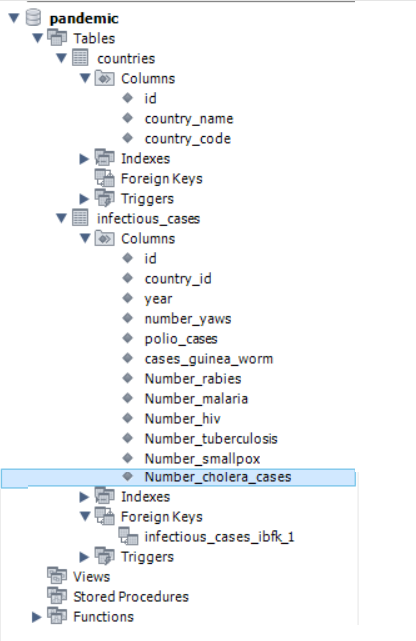
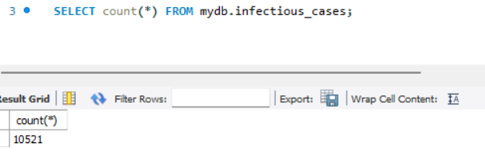
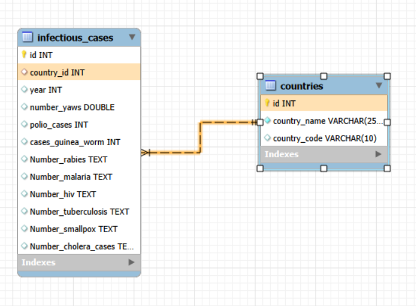
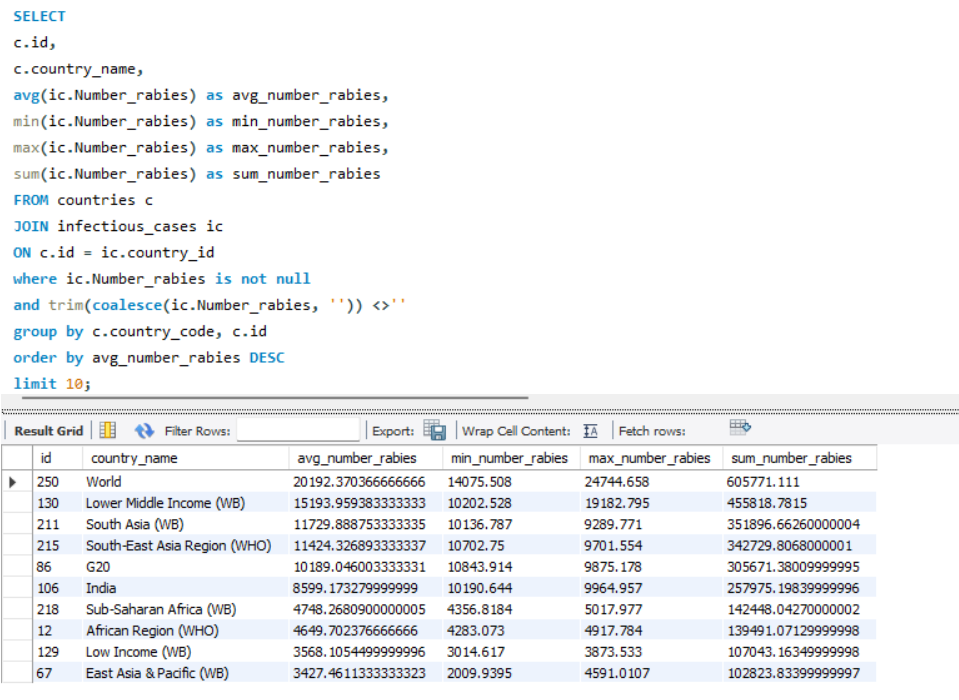
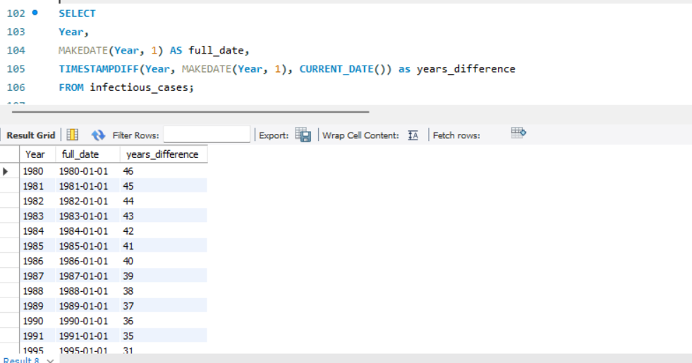
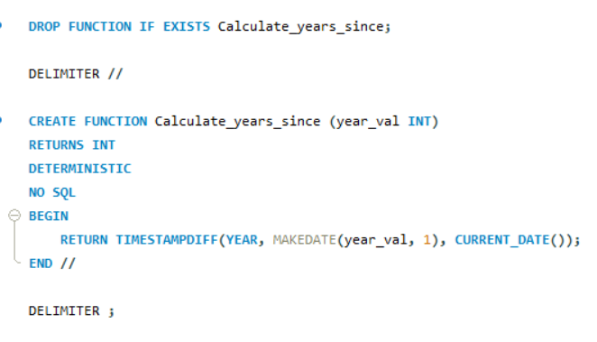
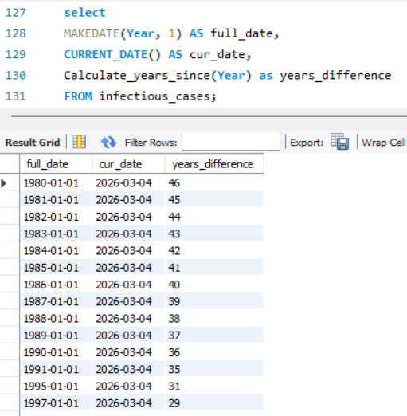

-- 1-----------------------
create schema pandemic;

use pandemic;

-- 2-----------------------

CREATE TABLE entities (
id INT AUTO_INCREMENT PRIMARY KEY,
country_name VARCHAR(255) NOT NULL,
country_code VARCHAR(10) UNIQUE
);

insert into countries (country_name, country_code)
select distinct Code, Entity
from infectious_cases;

select \* from infectious_cases;

CREATE TABLE infectious_cases_normalized (
id INT AUTO_INCREMENT PRIMARY KEY,
country_id INT,
year INT,
number_yaws DOUBLE,
polio_cases INT,
cases_guinea_worm INT,
--
--
FOREIGN KEY (country_id) REFERENCES country(id)
);

INSERT INTO infectious_cases_normalized (country_id, year, number_yaws, polio_cases, cases_guinea_worm)
SELECT
c.id,
ic.Year,
ic.Number_yaws,
ic.polio_cases,
ic.cases_guinea_worm
--
--
FROM infectious_cases ic
JOIN countries c ON ic.Entity = c.country_name AND ic.Code = c.country_code;

UPDATE infectious_cases SET Code = NULL WHERE Code = '';

DROP TABLE infectious_cases;

RENAME TABLE infectious_cases_normalized TO infectious_cases;

-- 3-----------------------

SELECT
c.id,
c.country_name,
avg(ic.Number_rabies) as avg_number_rabies,
min(ic.Number_rabies) as min_number_rabies,
max(ic.Number_rabies) as max_number_rabies,
sum(ic.Number_rabies) as sum_number_rabies
FROM countries c
JOIN infectious_cases ic
ON c.id = ic.country_id
where ic.Number_rabies is not null
and trim(coalesce(ic.Number_rabies, '')) <>''
group by c.country_code, c.id
order by avg_number_rabies DESC
limit 10;

-- 4-----------------------

SELECT
Year,
MAKEDATE(Year, 1) AS full_date,
TIMESTAMPDIFF(Year, MAKEDATE(Year, 1), CURRENT_DATE()) as years_difference
FROM infectious_cases;

-- 5-----------------------

DROP FUNCTION IF EXISTS Calculate_years_since;

DELIMITER //

CREATE FUNCTION Calculate_years_since (year_val INT)
RETURNS INT
DETERMINISTIC
NO SQL
BEGIN
RETURN TIMESTAMPDIFF(YEAR, MAKEDATE(year_val, 1), CURRENT_DATE());
END //

DELIMITER ;

select
MAKEDATE(Year, 1) AS full_date,
CURRENT_DATE() AS cur_date,
Calculate_years_since(Year) as years_difference
FROM infectious_cases;

